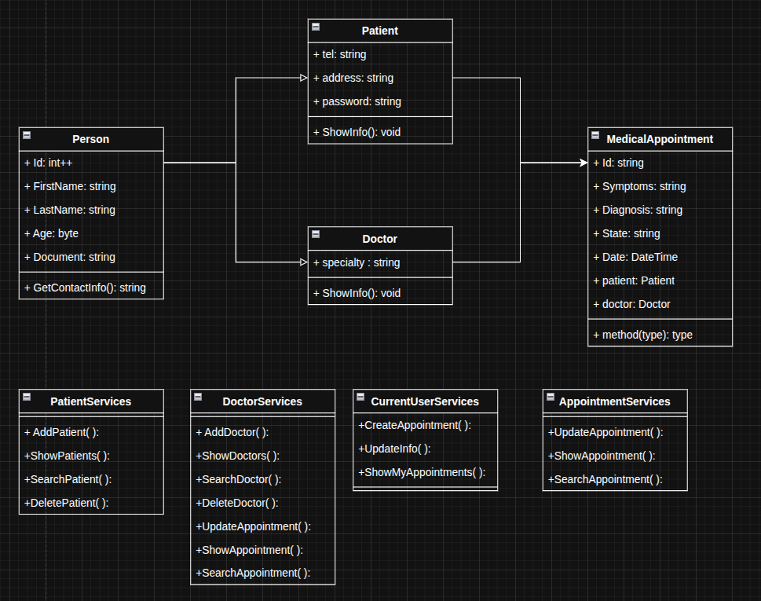
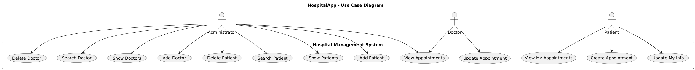

# 🏥 HospitalApp

## Overview

**HospitalApp** is a console-based management system developed in **C# (.NET)** that allows hospitals to efficiently manage their **patients, doctors, and medical appointments**.  
The application follows a **clean, modular architecture** that integrates **Object-Oriented Programming (OOP)**, **interfaces**, **repositories**, and **services** layers for scalability and maintainability.

---

## ✨ Main Features

### 👨‍⚕️ Doctor Management
- Register and remove doctors.  
- View and search doctor information.  
- Assign pending appointments to doctors.  
- Update appointment states and diagnoses.

### 🧑‍🤝‍🧑 Patient Management
- Register new patients.  
- Display all registered patients.  
- Search or delete patient records.  
- Automatically assign unique IDs to each patient.

### 📅 Appointment Management
- Create new medical appointments.  
- View all existing appointments.  
- Prevent overlapping appointment dates.  
- Update appointment state (`Pending`, `In Progress`, `Completed`, `Canceled`).  
- Update medical diagnosis.  
- Automatic warning system when an appointment is updated by user email.

### 🔐 Authentication Simulation
- Basic verification for users and doctors using unique document identifiers.  
- Console-based interactions for secure and simple testing.

---

## 🧠 Architecture

The system follows a **multi-layered architecture**:

```
HospitalApp
│
├── models/           # Domain entities (Person, Doctor, Patient, Appointment)
├── repositories/     # Data access and persistence (in-memory repositories)
│   └── interfaces/   # Repository interface definitions
├── services/         # Core business logic (AppointmentServices, etc.)
│   └── interfaces/   # Service interface definitions
├── ui/               # Console menus and message handlers
│   ├── menus/        # Main user interfaces
│   └── responses/    # System messages and feedback
└── Program.cs        # Entry point of the application
```

---

## ⚙️ Technologies Used

- **C# (.NET 8)**  
- **Object-Oriented Programming (OOP)**  
- **Interface Implementation & Dependency Inversion**  
- **Singleton Pattern** for repositories  
- **Console UI** for user interaction  
- **Error Handling with Try/Catch Blocks**

---

## 📘 UML Documentation

### 🧩 Class Diagram
The class model represents relationships between entities and service responsibilities.



### 🎯 Use Case Diagram
This diagram illustrates how different user roles interact with the system.



---

## 🚀 Getting Started

### Prerequisites
- **.NET 8 SDK** or later  
- Any C# compatible IDE (e.g., Visual Studio Code, Rider, or Visual Studio)

### Installation
```bash
# Clone the repository
git clone https://github.com/YourUsername/HospitalApp.git
cd HospitalApp

# Build the project
dotnet build

# Run the application
dotnet run
```

---

## 🧩 Example Console Flow

```
.________________________________.
|////////| Doctor Menu |\\\\|
|================================|
|1. Take Appointment             |
|2. Create Appointment           |
|3. Show Appointments            |
|4. Log out                      |
.--------------------------------.

> Option: 2
Enter Patient Document: 123456789
Enter Patient Name: John Doe
Enter Doctor Name: Dr. Smith
Enter Doctor Specialty: Cardiology
Enter Symptoms: Chest Pain
Enter Date and Time (yyyy-MM-dd HH:mm): 2025-10-14 09:00
Appointment created successfully!
```

---

## 📬 Future Improvements

- Integration with a real database (SQL Server or PostgreSQL).  
- Implementation of authentication and authorization system.  
- Graphical interface using **WinForms** or **WPF**.  
- RESTful API version with **ASP.NET Core**.  
- Logging and monitoring system.

---

## 🧾 License

This project is licensed under the **MIT License**.  
You are free to use, modify, and distribute it with proper attribution.

---

## 👨‍💻 Author

**Lucas Chacón**  
Developer | Software Engineering Student  
🌐 GitHub: [github.com/LDanielreyes](https://github.com/LDanielreyes)

---

> *“Good software is built not only with logic — but with structure, clarity, and care.”*  
> — *HospitalApp Project Philosophy*
